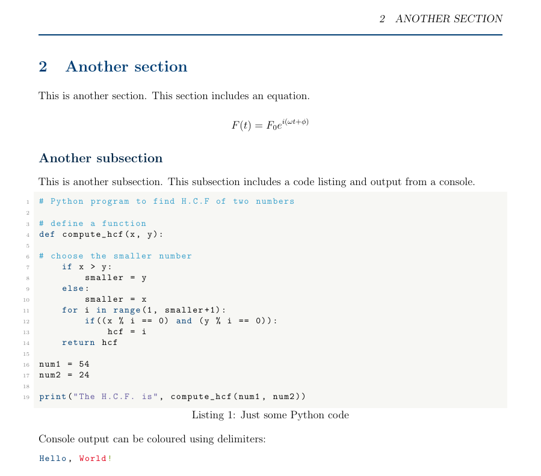

# Aarhus University LaTeX Report Template

`AU-LaTeX` is an unofficial LaTeX template for reports to be submitted to Aarhus University. While the template follows Aarhus University branding guidelines and colour schemes closely, it is not an official template and it is created "by a student, for students".

## Features

* Follows the [AU colour scheme](https://medarbejdere.au.dk/en/administration/communication/guidelines/guidelinesforcolours/) for text and listings
* Automatically generated title page, header and footer based on given parameters (report title, course name, etc.)
* Complementary matching *MATLAB* and *matplotlib* schemes

## Screenshots

### Title page example


### Section example



## Usage

Clone the repository in a new folder:

```shell
git clone https://git.dsme.cc/taskbjorn/au-latex.git
```

(Optional) Remove the example assets using the provided script (requires PowerShell):

```shell
cd au-latex
./git-repo-cleanup.pwsh
```

Open `au-report.tex` and fill out the variables section:

```latex
%% ----------- BEGIN VARIABLES ----------- %%

% Set course name
\newcommand{\aucoursename}{Course Name}
(...)
```

Type your contents in :

```latex
%% ----------- BEGIN CONTENT ----------- %%

\ausection{01-a-section}
(...)
```

Exchange the default titlepage header image with your titlepage header image under `assets/graphics/titlepage.jpg`

## Including assets

### Including graphics

By default, the relative path for graphics elements refers to subfolder `./assets/graphics`. If you prefer a different path, edit `preamble.tex` as follows:

```latex
(...)
% Set root path for graphics assets
\graphicspath{{your-path}}
```

### Including listings

By default, the relative path for listings refers to subfolder `./assets/listings`. If you prefer a different path, edit `preamble.tex` as follows:

```latex
(...)
% Set root path for listings assets
\newcommand*\lstpath[1]{\lstset{inputpath=#1}}
\lstpath{your-path}
```

## Plot styles

### MATLAB plot styles

If you would like to include MATLAB figures with matching style, a [MATLAB script](./template/extras/matlab/au_preset.m) setting MATLAB default figure and plotting settings is provided. Simply add the script to the root of your MATLAB path and add the following to your MATLAB script:

```matlab
(...)
au = auColorScheme()
```

The script changes the default MATLAB plot settings for the current session and returns a structure. You may access any colour from the [AU colour scheme](https://medarbejdere.au.dk/en/administration/communication/guidelines/guidelinesforcolours/) by simply referencing it by its name as follows:

```matlab
au.colours.darkblue

ans =

         0    0.1451    0.2745
(...)
```

### matplotlib plot styles

If you would like to include matplotlib figures with matching styles, a [matplotlibrc](extras/matplotlib/matplotlibrc) file is included. Copy it to the root of your Python application to generate plots matching the AU color scheme.

If you would only like to use AU style for a certain plot, you may also load the included style file `au.mplstyle` on demand as follows:

```python
# Set plot style to Aarhus University template
plt.style.use('<path-to-mplstyle>/au.mplstyle')
```

### Showing console output

In addition to a default style to pretty print code following the AU color scheme using package `lstlisting`, you may also add similarly formatted console output (such as the output from a Jupyter notebook cell) as follows:

```latex
\begin{lstlisting}[style = console-output]
(...)
\end{lstlisting}
```

You may also higlight part of your console output using delimiters `(STARTRC, ENDRC)`, `(STARTBC, ENDBC)` and `(STARTGC, ENDGC)` in your code snippet to higlight output in red, blue and green respectively.

```latex
\begin{lstlisting}[style = console-output]
Hello, STARTRCWorld!ENDRC
\end{lstlisting}
```

## Compatibility

The template was tested with [pdfTeX](https://www.tug.org/applications/pdftex/) on Microsoft Windows 10 running [MiKTeX](https://miktex.org) distribution v21.2.

## License

This code is released under [GNU General Public License (GPL) v3.0](LICENSE).